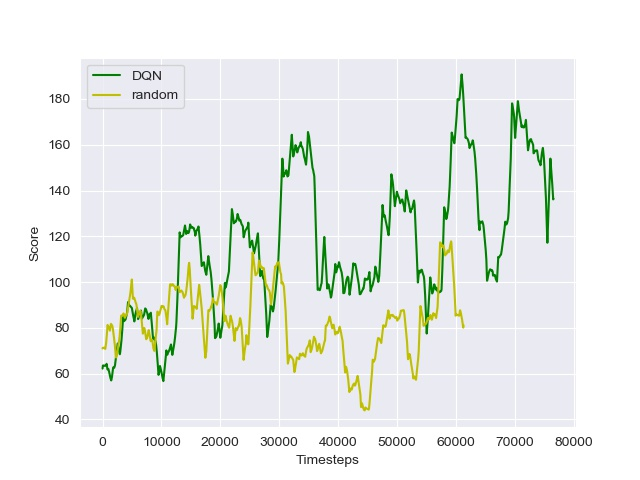

# dqn-on-space-invaders

## Overview

This is a PyTorch implementation of a Deep Q-Network agent trained to play the Atari 2600 game of Space Invaders. The related paper is the following: [Playing Atari with Deep Reinforcement Learning](https://arxiv.org/pdf/1312.5602v1.pdf), published in 2014 by Google Deepmind. 

This repository also corresponds to the source code for this post (LINK TO BE ADDED LATER) I have written on the subject.

## Dependencies

Install the requirements using this command:

```bash
pip install -r requirements.txt
```

There is one more thing to install to have access to the Atari environment. In fact, OpenAI gym library does not support by default the Atari environment. 

### Linux users

Simply run the following command:
```bash
pip install atari-py
```
### Windows users

Start by running the same as Linux users, if you have some errors popping up then detailed instructions to install Atari environments in Windows platforms are given [here](https://github.com/Kojoley/atari-py).    

## Usage

Once dependencies are installed, you can open `main.py` and decide whether you want to train or test the agent. This can be done by setting the `TRAIN` variable to either `True`or `False`. Other hyper-parameters are to be specified in the same file.

If trained, the agent's weights are saved in `./train`. Otherwise, videos of the agent playing are stored in `./test/`.

## Results

Below are the curves of the scores obtained throughout the training phase by the DQN agent as well as a random agent used as a baseline:

 

The DQN agent has played 100 episodes, 10000 timesteps each, and it has been able to improve its decision-making process as the training progresses. In fact, it starts by randomly selecting actions, waiting for the replay buffer to be sufficiently full to start the training. After several episodes of playing, the agent starts showing learning improvements and rather satisfactory results by the end of the training. This is due to the fact that its policy becomes progressively less random, as the update rule encourages it to exploit actions with higher rewards. 

Here is a game where the agent is playing after being trained: 

 

It has done a pretty good job overall. Nevertheless, it has to be trained more and perhaps get its policy network tuned so that it can get a higher score.

## TODO
- [ ] Add the possibility of hyper-parameters tuning.
- [ ] TensorBoard support.
- [ ] Add a run manager.

## Resources

[Playing Atari with Deep Reinforcement Learning](https://arxiv.org/pdf/1312.5602v1.pdf )

[Frame Skipping and Pre-Processing for Deep Q-Networks on Atari 2600 Games](https://danieltakeshi.github.io/2016/11/25/frame-skipping-and-preprocessing-for-deep-q-networks-on-atari-2600-games/)

[How RL agents learn to play Atari games](https://www.youtube.com/watch?v=rbsqaJwpu6A&feature=youtu.be&t=9m55s)

